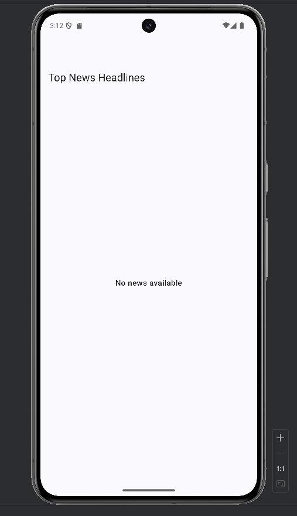
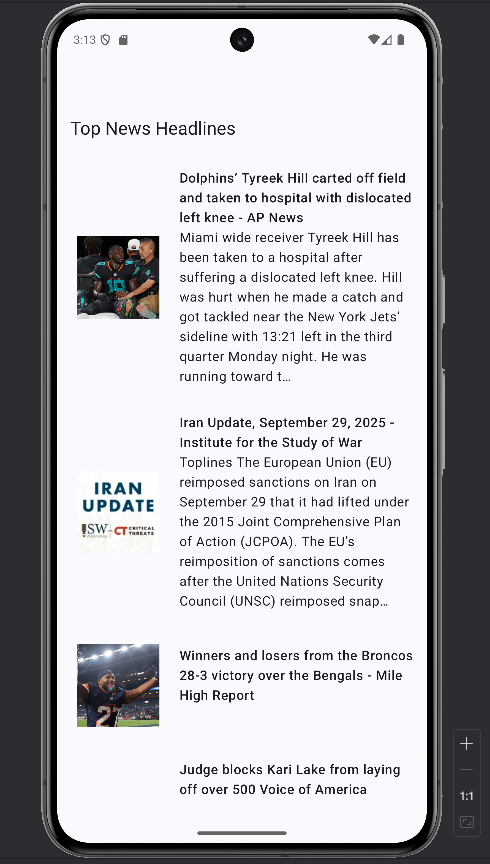
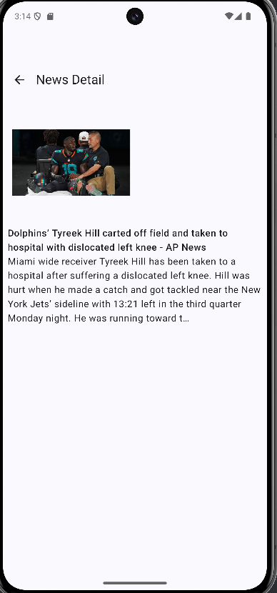

# News Headlines App

## How to run the app
1. To update using own API_KEY for `newsapi`, you can change it on `app/build.gradle.kts`
```kts
defaultConfig {
        applicationId = "com.weynard02.newsheadlinesapp"
        minSdk = 24
        targetSdk = 36
        versionCode = 1
        versionName = "1.0"

        testInstrumentationRunner = "androidx.test.runner.AndroidJUnitRunner"
        buildConfigField("String", "BASE_URL", "\"https://newsapi.org/v2/\"")
        buildConfigField("String", "API_KEY", "\"Put_your_api_key_here\"")
    }
```

2. Do `sync now` and build the project
3. Run the project on selected device (or emulator)



Note: If there was no news available on country "id", you can try change it to "us" on `ApiService.kt` in country's query.
```kotlin
interface ApiService {
    // Last time I checked, there was no news in "id", you can change to "us"
    @GET("top-headlines?country=id")
    suspend fun getTopHeadlines(@Query("apiKey") apiKey: String): NewsResponse
}
```
Home Screen:



Detail Screen:




## What you’re proud of or enjoyed building
I usually use an XML layout for developing applications in projects. I only used Jetpack Compose for practice and the final project from the course (not using MVVM).
**I am really proud that I can build an application using Jetpack Compose for the technical test while also using ViewModel for the first time.**
One of the things that differentiates here is that mutableStateFlow is more commonly used for composable than LiveData, which is used for XML style.
Those are basically the same thing, where they observe the value state when there is an update on the value.

## What you’d improve or add next (if you had more time)
If there's more time, I will spend more time to improve the UI design side because I only focused on the functionality by itself as per the requirements.

## Any challenges you faced and how you tried to solve them
- I had a time where I was confused about how I could create a detailed page by using only `NewsHeadlineApp.kt` for home. I just realized I have to refactor into both screens `HomeScreen` and `DetailScreen` in order to have two pages on one application. So, I refactored the module and I have to apply Navigation `Screen` and `NavHost`.
- I also faced an error where I couldn't access the detail page because the route was not found with this code:
```kotlin
data object Detail : Screen("detail/{title}/{description}/{urlToImage}") {
        fun createRoute(title: String, description: String, urlToImage: String): String = "detail/$title/$description/$urlToImage"
    }
```
It turns out I can't do that, because these variables can contain a space. To fix that, I'm using `Uri.encode` to convert the spaces into characters.
```kotlin
data object Detail : Screen("detail/{title}/{description}/{urlToImage}") {
        fun createRoute(title: String, description: String, urlToImage: String): String {
            val uTitle = Uri.encode(title)
            val uDescription = Uri.encode(description)
            val uUrlToImage = Uri.encode(urlToImage)

            return "detail/$uTitle/$uDescription/$uUrlToImage"
        }
    }
```
- There was an error where there was some data missing from API (title, description, or urlToImage), so I have to make the response parameters nullable (`ArticlesItem`). 